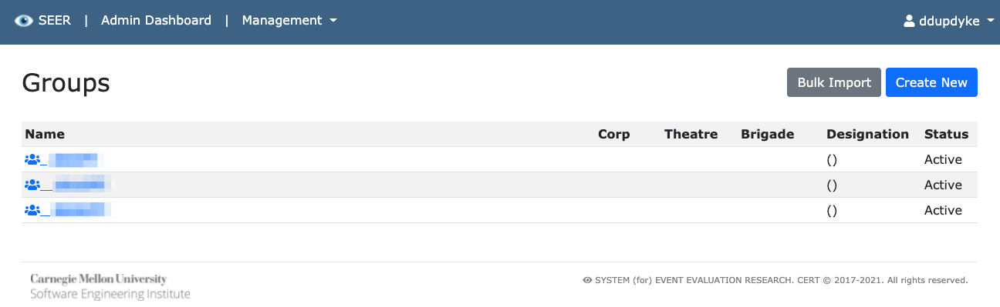
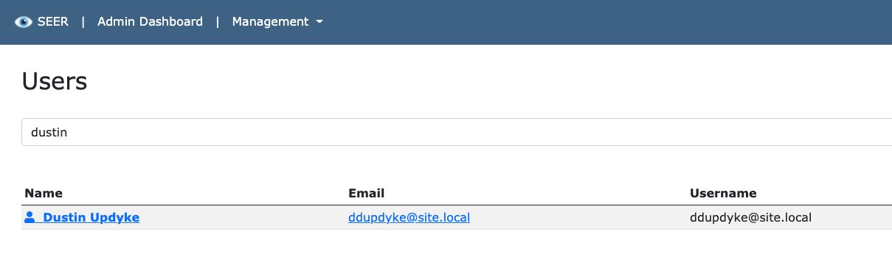
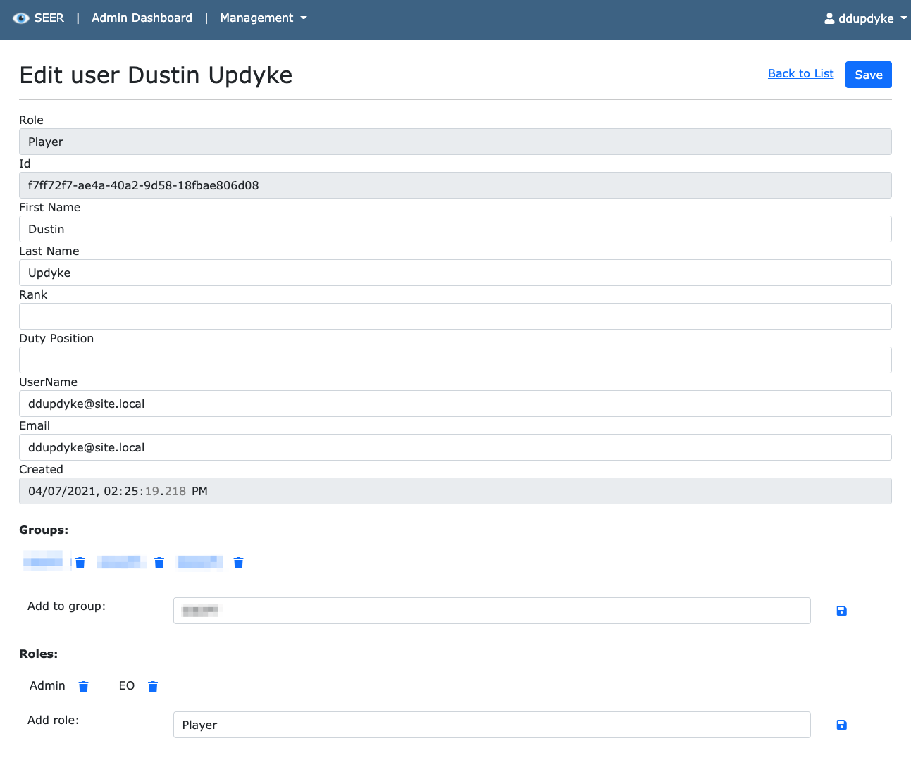
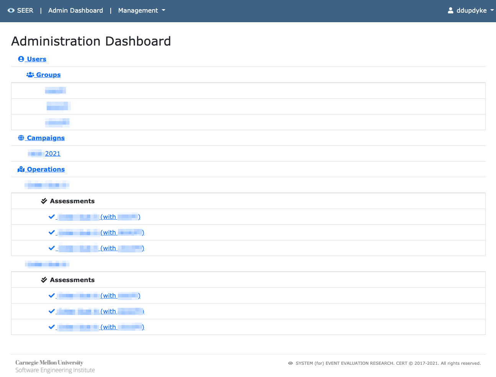
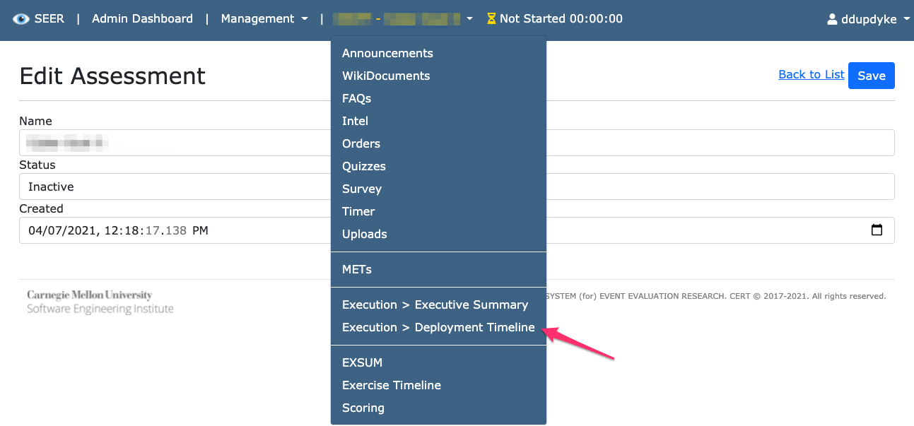
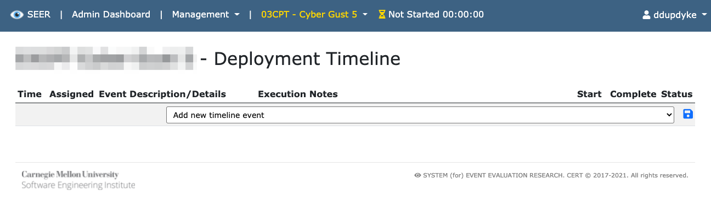
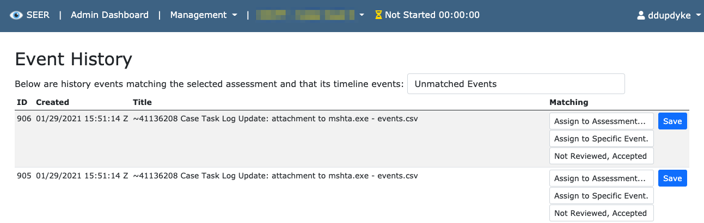

# SEER Quickstart

[<-- Main readme](../readme.md)

---

During installation, at least one administrative user must be created in order to effectively run SEER.

Then that administrator must complete at least the following steps:

First, setup an assessment within a campaign. This is typically (and most easily) done via the [seed file](../src/App_Data/config/seed.json). The hierarchy we use within SEER is:

- Campaign (1) - your training efforts for a year, perhaps
  - Operations (n) - think of this as training evolutions
    - Assessments (n) - several groups or teams might go through an evolution

## Groups

Assessments are typically done by group. So once a group is created, we can then add the associated users to that group.

`Administration --> Management --> Groups`

## Users

Users are managed by Identity, but their roles are managed directly within SEER. A user account is created automatically on a successful login to Identity. We can modify their information, add them to a group, or change their role by navigating to:

`Administration --> Management --> Users`

And searching for the user by beginning to type their name or email address. 

Then click on the user to modify once they show in the list.

## Injects

In order to tie events that happen back to our assessment, we need at least some notion of the injects that we will be executing within the exercise.

`Administration --> Management --> Inject Catalog`

## Assessment

Now revisit the dashboard in order to tie all of these entities we've created back to a specific assessment:

`Administration --> Admin Dashboard`

Click on the applicable assessment in order to continue.

## Timeline

Once injects have been created, the exercise timeline can be created and ordered from them.

The timeline is a list of injects that will be executed during this training or exercise event. We can add them from the drop down menu.

## Event History

As events occur elsewhere, we need to associate them with the injects from the timeline. Once one event from a The Hive case, task or otherwise is associated, any others that share that same identifier in The Hive will automatically be associated in SEER.

`Administration --> Management --> Event History`

